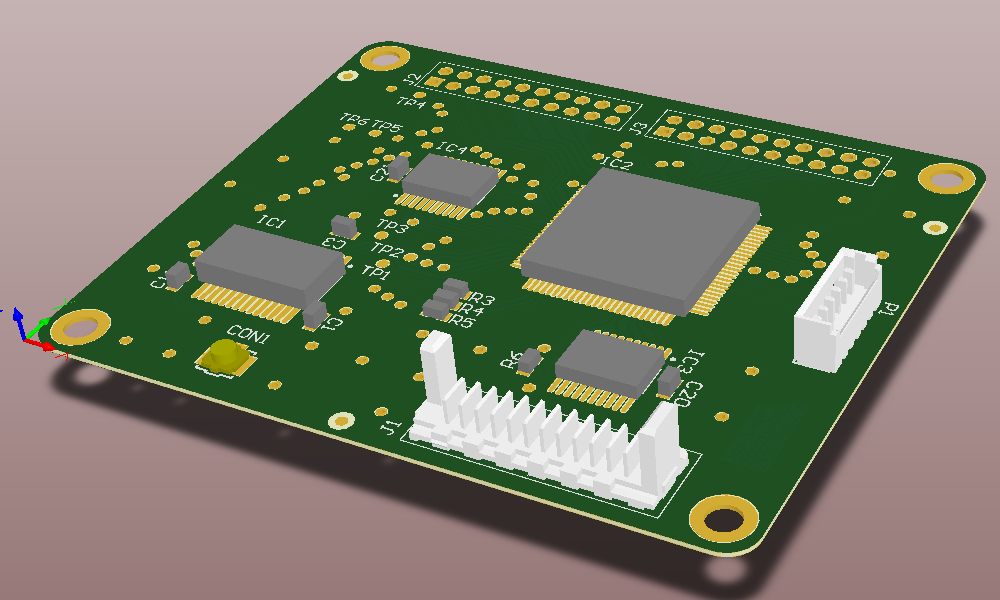

LISC: Line Image Sensor Controller
======

The Line Image Sensor Controller (LISC) is a universal electronics board that contains readout electronics for various linear image sensors (CCD, CMOS APS, FPA). 
It can be connected to a data acquisition controller (e. g. microcontroller) for further data processing and transmission to a higher-level system. 
The LISC can be used within optical spectrometers and industrial linear cameras.

 

### Hardware

The Hardware consists of the Electronic Board and the Readout Logic written in VHDL and running on a Xilinx CPLD. See [Documentation](/Documentation/LineImageSensorController.pdf) for details.

### Firmware

The test firmware runs on a STM32F407 microcontroller. It requests the digital video data over DCMI interface using DMA controller and provides it over serial interface
to a user PC.

---
